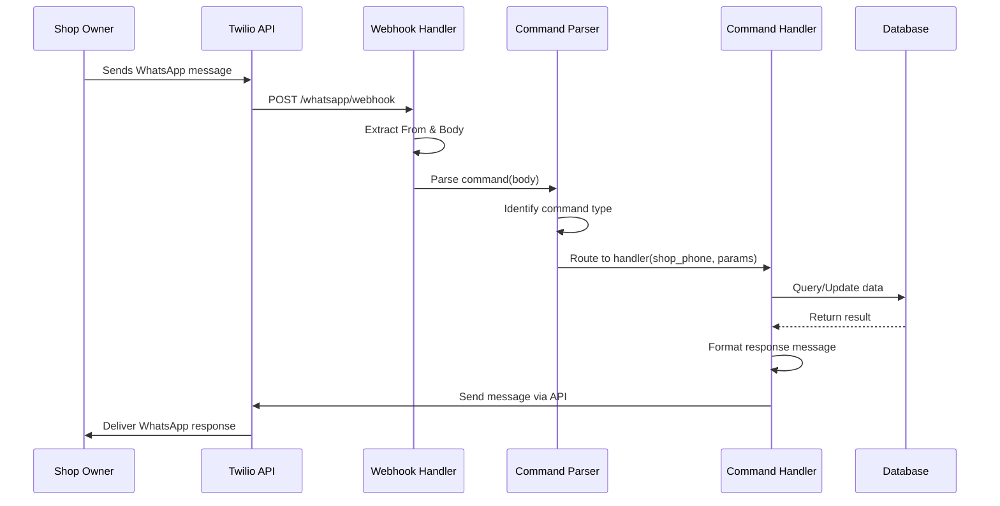
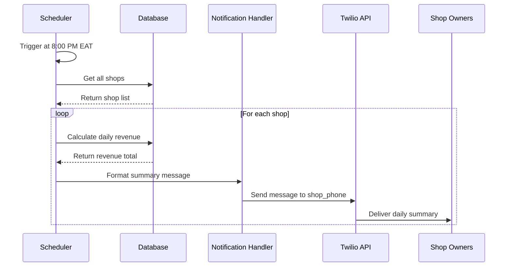
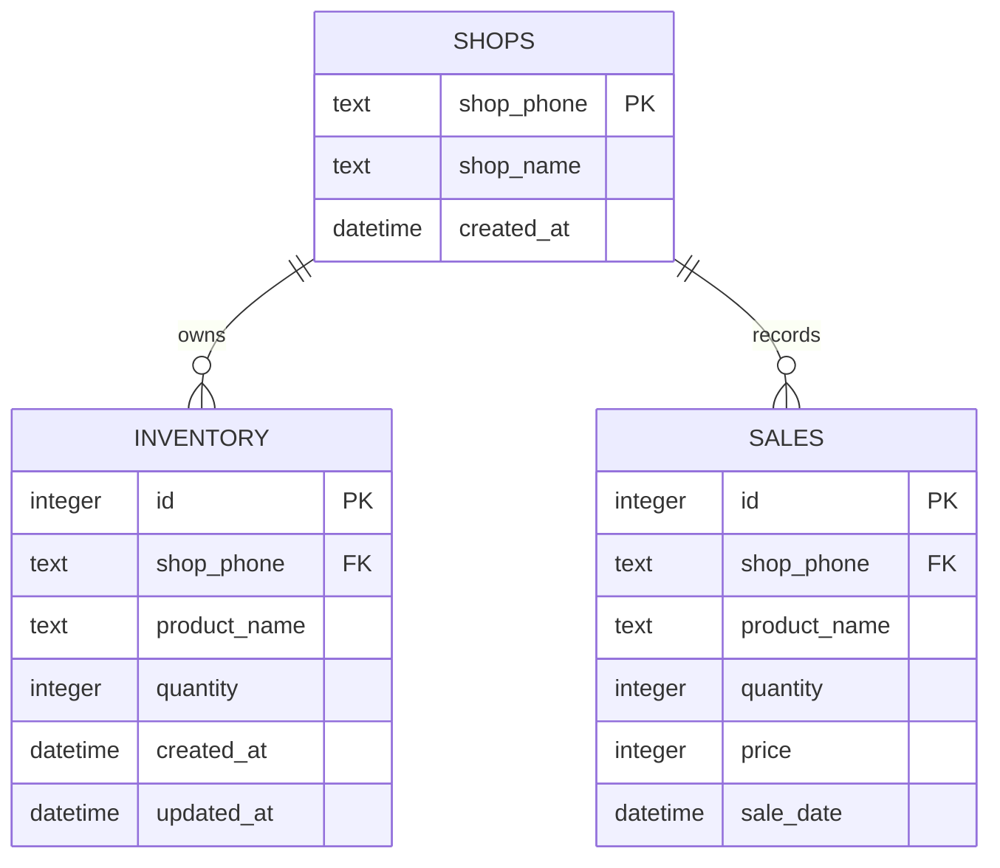

# Design Document: WhatsApp Sales & Inventory Tracker

## Overview

The WhatsApp Sales & Inventory Tracker is a multi-tenant SaaS application that enables small shop owners in Kampala, Uganda to manage inventory and track sales through simple WhatsApp text commands. The system leverages WhatsApp phone numbers as unique tenant identifiers, eliminating the need for traditional authentication while providing automatic data isolation.

### Key Design Principles

1. **Zero-friction onboarding**: No registration required - shops are automatically initialized on first message
2. **Natural language interface**: Commands use simple, intuitive text patterns that match how shop owners naturally communicate
3. **Multi-tenancy by design**: Phone number-based isolation ensures complete data privacy between shops
4. **Minimal infrastructure**: Designed for free-tier hosting with SQLite and Node.js
5. **Timezone awareness**: All operations use East Africa Time (EAT/UTC+3) for consistency with local business hours

### Technology Stack

- **Runtime**: Node.js (v18+)
- **Web Framework**: Express.js
- **Database**: SQLite with async/await wrapper
- **WhatsApp Integration**: Twilio WhatsApp API
- **Scheduling**: node-cron for daily notifications
- **Deployment**: Render.com free tier
- **Environment Management**: dotenv

## Architecture

### System Architecture Diagram

```mermaid
graph TB
    subgraph "External Services"
        WA[WhatsApp User]
        TW[Twilio WhatsApp API]
    end
    
    subgraph "Application Layer"
        WH[Webhook Endpoint<br/>/whatsapp/webhook]
        CP[Command Parser]
        CH[Command Handlers]
        SC[Scheduler<br/>Daily Notifications]
    end
    
    subgraph "Data Layer"
        DB[(SQLite Database)]
        DH[Database Helpers]
    end
    
    WA -->|Sends Message| TW
    TW -->|POST Request| WH
    WH -->|Extract Body & Phone| CP
    CP -->|Route Command| CH
    CH -->|Query/Update| DH
    DH -->|SQL Operations| DB
    CH -->|Send Response| TW
    TW -->|Deliver Message| WA
    SC -->|8PM Daily| DH
    SC -->|Send Summaries| TW
    
    style WA fill:#25D366
    style TW fill:#00A4EF
    style DB fill:#003B57
```



### Request Flow

#### Incoming Message Flow



#### Daily Notification Flow



### Multi-Tenancy Strategy

The system implements **implicit multi-tenancy** using WhatsApp phone numbers as tenant identifiers:

1. **Tenant Identification**: The `From` field in Twilio webhook requests contains the shop's WhatsApp number in format `whatsapp:+2567xxxxxxxx`
2. **Data Isolation**: All database tables include a `shop_phone` column that serves as the tenant discriminator
3. **Query Filtering**: Every database query automatically filters by the authenticated shop_phone
4. **No Shared Data**: No data is shared between tenants - each shop operates in complete isolation
5. **Automatic Provisioning**: New shops are created on-demand when a new phone number sends its first message

**Security Properties**:
- Phone number spoofing is prevented by Twilio's authentication layer
- Database queries use parameterized statements to prevent SQL injection
- No cross-tenant data leakage is possible due to mandatory shop_phone filtering

## Components and Interfaces

### Component Breakdown

#### 1. Webhook Handler (`index.js`)

**Responsibilities**:
- Expose POST endpoint at `/whatsapp/webhook`
- Extract sender phone number and message body from Twilio request
- Route requests to command parser
- Handle errors and send responses via Twilio API
- Initialize Express server and database on startup

**Interface**:
```javascript
// POST /whatsapp/webhook
// Request body (from Twilio):
{
  From: "whatsapp:+256712345678",
  Body: "Sold Sugar 5 10000",
  MessageSid: "...",
  // ... other Twilio fields
}

// Response: 200 OK (Twilio expects quick response)
```

#### 2. Command Parser

**Responsibilities**:
- Identify command type from message body
- Extract parameters using regex patterns
- Handle product names with spaces
- Validate command format
- Return structured command object or error

**Interface**:
```javascript
parseCommand(messageBody: string): CommandResult

// CommandResult structure:
{
  type: 'SOLD' | 'RESTOCK' | 'ADD_PRODUCT' | 'STOCK' | 'SUMMARY' | 'UNDO' | 'HELP' | 'UNKNOWN',
  params: {
    productName?: string,
    quantity?: number,
    price?: number
  },
  error?: string
}
```

**Parsing Strategy**:
- **Sold Command**: Match pattern, extract last 2 tokens as quantity/price, remaining as product name
- **Restock Command**: Extract last token as quantity, remaining as product name
- **AddProduct Command**: Extract last token as initial stock, remaining as product name
- **Simple Commands**: Match exact keywords (Stock, Summary, Undo, Help, MyShop)

#### 3. Command Handlers

**Responsibilities**:
- Execute business logic for each command type
- Interact with database layer
- Format response messages
- Handle errors gracefully
- Enforce business rules (stock validation, duplicate checks)

**Handler Functions**:
```javascript
async handleSold(shopPhone, productName, quantity, price): Promise<string>
async handleRestock(shopPhone, productName, quantity): Promise<string>
async handleAddProduct(shopPhone, productName, initialStock): Promise<string>
async handleStock(shopPhone): Promise<string>
async handleSummary(shopPhone): Promise<string>
async handleUndo(shopPhone): Promise<string>
async handleHelp(shopPhone): Promise<string>
```

#### 4. Database Layer (`db.js`)

**Responsibilities**:
- Initialize SQLite database and schema
- Provide async helper functions for CRUD operations
- Enforce data integrity constraints
- Handle database errors
- Manage transactions for atomic operations

**Helper Functions**:
```javascript
async initializeDatabase(): Promise<void>
async getShop(shopPhone): Promise<Shop | null>
async createShop(shopPhone): Promise<void>
async getProduct(shopPhone, productName): Promise<Product | null>
async getAllProducts(shopPhone): Promise<Product[]>
async addProduct(shopPhone, productName, quantity): Promise<void>
async updateStock(shopPhone, productName, newQuantity): Promise<void>
async recordSale(shopPhone, productName, quantity, price): Promise<void>
async getLastSale(shopPhone): Promise<Sale | null>
async deleteSale(saleId): Promise<void>
async getDailyRevenue(shopPhone, date): Promise<number>
async getAllShops(): Promise<Shop[]>
```

#### 5. Twilio Integration

**Responsibilities**:
- Send WhatsApp messages via Twilio API
- Handle API errors and retries
- Format messages for WhatsApp delivery

**Interface**:
```javascript
async sendWhatsAppMessage(to: string, body: string): Promise<void>

// Parameters:
// - to: WhatsApp number in format "whatsapp:+256..."
// - body: Message text (max 1600 characters)
```

#### 6. Scheduler

**Responsibilities**:
- Run daily revenue notification task at 8:00 PM EAT
- Iterate through all shops
- Calculate and send daily summaries
- Handle timezone conversion (UTC to EAT)

**Interface**:
```javascript
// Cron expression: '0 20 * * *' in EAT (17:00 UTC)
scheduleDailyNotifications(): void
```

## Data Models

### Database Schema

#### Shops Table
```sql
CREATE TABLE IF NOT EXISTS shops (
  shop_phone TEXT PRIMARY KEY,
  shop_name TEXT,
  created_at DATETIME DEFAULT CURRENT_TIMESTAMP
);
```

**Fields**:
- `shop_phone`: Unique WhatsApp number (e.g., "whatsapp:+256712345678")
- `shop_name`: Optional display name (currently unused, reserved for future)
- `created_at`: Timestamp of first message

#### Inventory Table
```sql
CREATE TABLE IF NOT EXISTS inventory (
  id INTEGER PRIMARY KEY AUTOINCREMENT,
  shop_phone TEXT NOT NULL,
  product_name TEXT NOT NULL,
  quantity INTEGER NOT NULL DEFAULT 0,
  created_at DATETIME DEFAULT CURRENT_TIMESTAMP,
  updated_at DATETIME DEFAULT CURRENT_TIMESTAMP,
  UNIQUE(shop_phone, product_name),
  FOREIGN KEY (shop_phone) REFERENCES shops(shop_phone)
);
```

**Fields**:
- `id`: Auto-incrementing primary key
- `shop_phone`: Tenant identifier
- `product_name`: Product name (supports spaces)
- `quantity`: Current stock level
- `created_at`: Product creation timestamp
- `updated_at`: Last modification timestamp

**Constraints**:
- UNIQUE(shop_phone, product_name): Prevents duplicate products per shop
- Foreign key to shops table ensures referential integrity

#### Sales Table
```sql
CREATE TABLE IF NOT EXISTS sales (
  id INTEGER PRIMARY KEY AUTOINCREMENT,
  shop_phone TEXT NOT NULL,
  product_name TEXT NOT NULL,
  quantity INTEGER NOT NULL,
  price INTEGER NOT NULL,
  sale_date DATETIME DEFAULT CURRENT_TIMESTAMP,
  FOREIGN KEY (shop_phone) REFERENCES shops(shop_phone)
);
```

**Fields**:
- `id`: Auto-incrementing primary key
- `shop_phone`: Tenant identifier
- `product_name`: Product sold (denormalized for historical accuracy)
- `quantity`: Units sold
- `price`: Total sale price in UGX
- `sale_date`: Transaction timestamp

**Design Notes**:
- Product name is denormalized (not a foreign key) to preserve historical records even if product is deleted
- Price is stored as INTEGER (UGX has no decimal subdivisions)
- sale_date uses CURRENT_TIMESTAMP which stores in UTC (converted to EAT for display)

### Entity Relationships



### Data Flow Examples

#### Example 1: Recording a Sale
```
1. User sends: "Sold Maize Flour 3 15000"
2. Parser extracts: {productName: "Maize Flour", quantity: 3, price: 15000}
3. Handler queries: SELECT quantity FROM inventory WHERE shop_phone=? AND product_name=?
4. Validates: current_stock (50) >= quantity (3) ✓
5. Inserts: INSERT INTO sales (shop_phone, product_name, quantity, price) VALUES (...)
6. Updates: UPDATE inventory SET quantity = quantity - 3 WHERE shop_phone=? AND product_name=?
7. Checks: new_quantity (47) < 20 → Include low stock warning
8. Responds: "✅ Sale recorded: Maize Flour x3 for 15,000 UGX. Stock: 47 units. ⚠️ Low stock!"
```

#### Example 2: First-Time Shop Initialization
```
1. New phone number sends: "Help"
2. Handler queries: SELECT * FROM shops WHERE shop_phone=?
3. Result: null (shop doesn't exist)
4. Creates shop: INSERT INTO shops (shop_phone) VALUES (?)
5. Seeds products: INSERT INTO inventory (shop_phone, product_name, quantity) VALUES 
   (?, 'Sugar', 50), (?, 'Rice', 100), (?, 'Salt', 75), (?, 'Maize Flour', 50)
6. Sends welcome message with command list
```

